# Getting started with Node-RED
----------------------------------------------------------------------------------------------------

Node-RED is a drag-and-drop visual tool which comes pre-installed on Raspbian. In this resource we will use Node-RED to control LEDs via the Raspberry Pi's GPIO pins.

## GPIO pins

One powerful feature of the Raspberry Pi is the row of GPIO pins along the top edge of the board. GPIO stands for General-Purpose Input/Output. These pins are a physical interface between the Raspberry Pi and the outside world. At the simplest level, you can think of them as switches that you can turn on or off (input), or that the Raspberry Pi can turn on or off (output).

The GPIO pins are used to connect the Raspberry Pi to electronic circuits, which allow it to control and monitor the outside world. Using the GPIO pins, the Raspberry Pi is able to turn LEDs on or off, run motors, and perform many other actions. It is also able to detect external conditions, such as temperature, light levels, and whether a switch has been pressed. We refer to this as physical computing.

There are 40 pins on the Raspberry Pi (26 pins on early models), and they provide various different functions.

If you have a RasPiO pin label, it can help to identify what each pin is used for. Make sure your pin label is placed with the keyring hole facing the USB ports, pointed outwards.

If you don't have a pin label, then this guide can help you to identify the pin numbers:

You'll see pins labelled as 3V3, 5V, GND and GP2, GP3, and so on:

|   |   |   |
|---|---|---|
| 3V3 | 3.3 volts | Anything connected to these pins will always receive 3.3V of power |
| 5V | 5 volts | Anything connected to these pins will always receive 5V of power |
| GND | ground | Zero volts, used to complete a circuit |
| GP2 | GPIO pin 2 | These pins are for general-purpose use and can be configured as input or output pins |
| ID_SC/ID_SD/DNC | Special purpose pins ||

**WARNING**: if you follow the instructions, then playing about with the GPIO pins is safe and fun. Randomly plugging wires and power sources into your Raspberry Pi, however, may destroy it, especially if you are using the 5V pins.

## Wire up the LED

1. Wire up an LED to GPIO pin 17 on your Raspberry Pi by following this diagram:

  

  The positive leg of the LED is usually longer, and it is this leg which should be inserted into the left side of the breadboard (e1 on the diagram).

## Start Node-RED

2. Start up your Raspberry Pi. Click on the Raspberry icon, then the **Programming** menu to open Node-RED.

  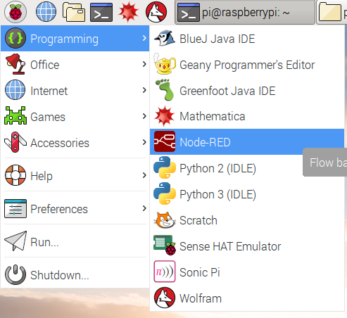

3. You should see a window displaying information about Node-RED starting up.

  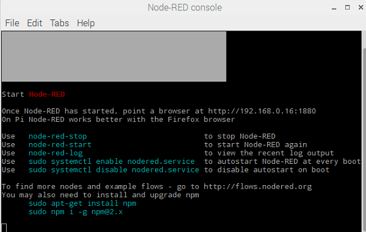

4. Now go to the **Internet** menu and open **Chromium Web Browser**.

  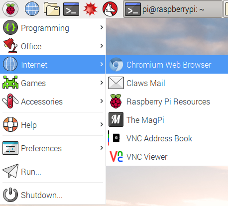

5. In Chromium, locate the address bar at the top and type in `localhost:1880`, then press Enter. This will display the Node-RED interface. (Your Raspberry Pi does not need to be connected to the internet to use Node-RED: `localhost` is the address the Raspberry Pi uses to refer to itself and `:1880` means that it is looking at port 1880.)

  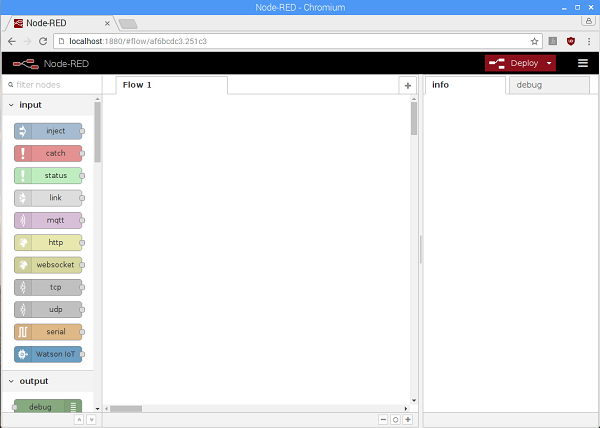

## Connecting to a GPIO pin

Programs in Node-RED are called **flows**. You can see that your blank page is labelled as **Flow 1** in the tab at the top. You can create as many flows as you want and they can all run at the same time. For this guide, we will only need one flow.

6. The coloured blocks on the left side of the interface are the **nodes**. Scroll right down to the bottom of the list and you will see some nodes labelled **Raspberry Pi**.

  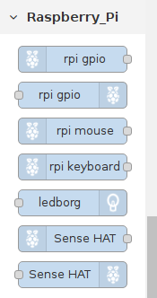

7. You will see two nodes with the label **rpi gpio**: these are the ones we will use to talk to the GPIO pins on the Raspberry Pi. The first one in the list, with the raspberry icon on the left, is for inputs. Using a button push to control something would be an example of an input. The second node, with the raspberry icon on the right, is for outputs. Switching on an LED would be an example of an output. Drag an output node onto the blank page in the middle.

  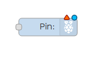

8. Double-click on the node and a box will appear to let you configure the node. Change the GPIO pin to be **GPIO17** and tick **Initialise pin state?**. Leave the setting for **Initial level of pin** on **low**. Give the node a name - we called it Green LED because the LED we used was green, but if yours is a different colour feel free to change the name. When you are finished, click **Done**.

  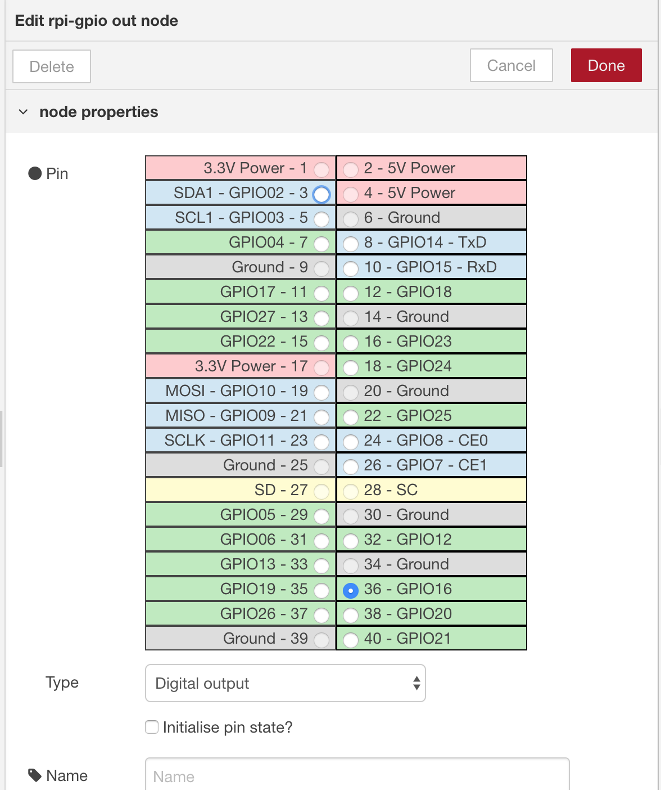

## Injecting messages

9. Now scroll back up to the list of nodes. To turn the LED on and off, we need an input. In Node-RED we can inject messages into the flow and cause things to happen as a result. Drag an **inject** node onto the flow.

  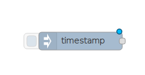

10. Double-click on the inject node. Use the drop down next to **Payload** to change the data type to **string** and type `1` in the Payload box - this will be the message. Type `On` in the **Name** box. Press Done.

  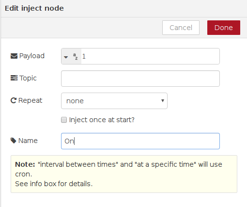

11. Repeat the previous steps to create another inject node, except this time add `0` as the payload message, and call this node **Off**.

  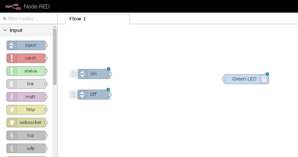

12. Now look for the grey dot on the right side of the inject nodes. Click and drag from the grey dot on the **On** node to the grey dot on your LED node to join them up. Repeat for the **Off** node, also joining it to the LED node.

  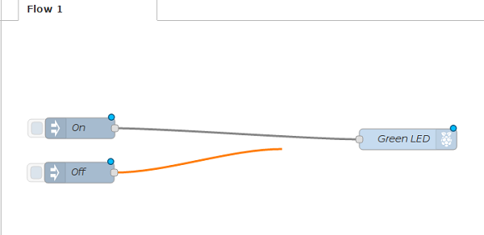

## Deploying the flow

13. Our flow is finished, so we can deploy it. Click on the big red **Deploy** button on the top right of the screen. A message should pop up at the top saying "Successfully deployed". This is similar to pressing the green flag in Scratch or F5 to run your code in Python.

  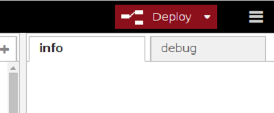

14. Now click on the blue square on the left of the **On** node to inject the message `1`. The **Green LED** node receives the message and your LED should light up. You should be able to turn the LED off by clicking the blue square on the **Off** node, which injects the message `0`.

  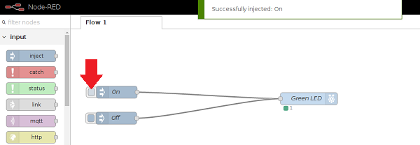

## Debugging your flow

15. If your LED doesn't turn on and off, firstly check that you have wired the components correctly on the breadboard. Make sure you have wired your LED to both **ground** and **pin 17** on your Raspberry Pi.

  You can also ask Node-RED to display debugging information by wiring up your nodes to a **Debug** node, which can be found under **output**. Drag in a debug node and wire your two inject nodes to it, then click Deploy. When you click the buttons to inject the message, Node-RED will show you what was injected in the **Debug** tab on the right side of the screen. Click the tab to display the messages.

  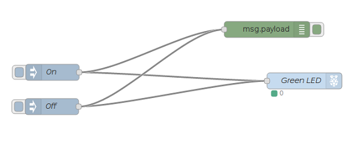

  For example, this is the output if you click first on the **On** node and then on the **Off** node.

  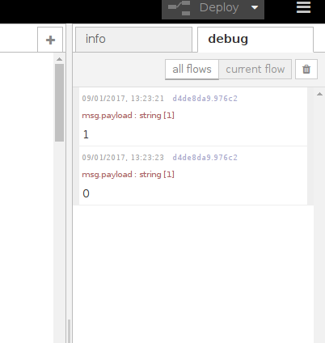
  
  ## Licence

***Getting started with Node-RED*** by the [Raspberry Pi Foundation](http://www.raspberrypi.org) is licenced under a [Creative Commons Attribution 4.0 International License](http://creativecommons.org/licenses/by-sa/4.0/).

Based on a work at https://github.com/raspberrypilearning/getting-started-with-node-red

